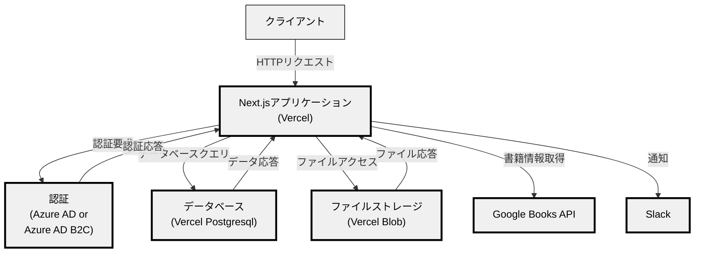

# Company-Library

Company Libraryは、社内の書籍を管理するためのアプリケーションです。  
Vercel上にデプロイすることで、どこの会社でも簡単に導入できます。

トップ画面


書籍の詳細画面


ユーザーの読書履歴画面


## Features

- 書籍の登録
- 書籍の検索
- 書籍の詳細表示
- 書籍の貸出と返却
- 書籍に関する感想の登録
- ユーザーの読書履歴の閲覧

## Architecture



認証基盤は他の認証基盤のニーズがあれば追加します。  
要望があれば、Issueを立ててください。

## Deploy your own

- Vercel
- Vercel Postgres
- Vercel Blob
- Azure AD or Azure AD B2C
- Slack

を使用します。

### 1. 認証基盤の設定

Azure ADまたはAzure AD B2Cを使用して認証を行います。

以下のどちらかを見て、設定を行ってください。

- [Azure ADの設定手順](https://next-auth.js.org/providers/azure-ad)
- [Azure AD B2Cの設定手順](https://next-auth.js.org/providers/azure-ad-b2c)

環境変数についてはVercelのプロジェクト作成時に設定するので手元に控えていてください。  
必要な環境変数については、`.env.example`を参照してください。

### 2. Vercelへのデプロイ

[Vercel](https://vercel.com)にデプロイします。  
同時に、Vercel PostgresとVercel Blobも追加します。  
以下のボタンをクリックして、デプロイしてください。  

[](https://vercel.com/new/clone?repository-url=https%3A%2F%2Fgithub.com%2Fcompany-library%2Fcompany-library&stores=%5B%7B%22type%22%3A%22postgres%22%7D%2C%7B%22type%22%3A%22blob%22%7D%5D)

環境変数では`.env.example`を参照して、認証基盤周りの環境変数を設定してください。

### 3. Slackの設定 (Optional)

Slackに通知を送るためには、SlackのWebhook URLが必要です。  
環境変数として、`SLACK_WEBHOOK_URL`を設定してください。  
設定が完了すると、書籍の登録時にSlackに通知が送られます。
設定がない場合は、通知は送られません。

## Run local

ローカルでの開発用のために、ローカルでの実行方法を記載します。

デプロイされた環境と同様に、認証基盤の設定が必要です。  
また、事前にVercel Blobを追加して、環境変数に`BLOB_READ_WRITE_TOKEN`として追加する値を手元に控えておいてください。

### 1. 依存関係のインストール

```bash
yarn install
```

### 2. 環境変数の設定

```bash
cp .env.example .env.local
```

`.env.local`に`POSTGRES_PRISMA_URL`と`POSTGRES_URL_NON_POOLING`以外の環境変数を設定してください。

### 3. DBの設定

DBとしてはPostgresを使用することもできますし、Vercel Postgresを使用することもできます。

Dockerを使用してPostgresを起動する場合は、以下のコマンドを実行してください。

```bash
docker-compose up -d  
```

Vercel Postgresを使用する場合は、Vercelのダッシュボードから、Vercel Postgresを追加してください。

`.env.local`に`POSTGRES_PRISMA_URL`と`POSTGRES_URL_NON_POOLING`を設定してください。

### 4. DBのマイグレーション

```bash
yarn db:generate
yarn db:push
```

### 5. ローカルサーバーの起動

```bash
yarn dev
```
