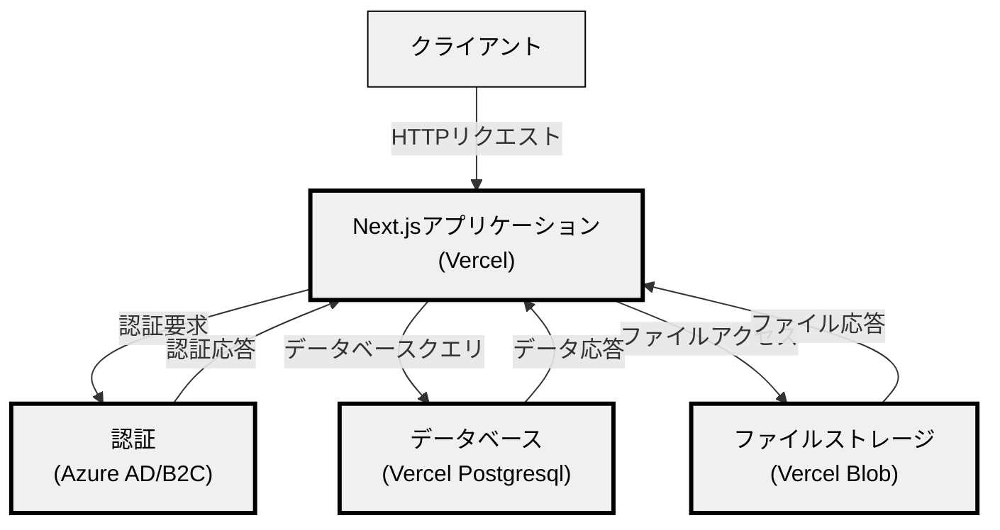

# Company-Library

Company Libraryは、社内の書籍を管理するためのアプリケーションです。  
Vercel上にデプロイすることで、どこの会社でも簡単に導入できます。

トップ画面


書籍の詳細画面


ユーザーの読書履歴画面


## Features

- 書籍の登録
- 書籍の検索
- 書籍の詳細表示
- 書籍の貸出と返却
- 書籍に関する感想の登録
- ユーザーの読書履歴の閲覧

## Architecture



## Deploy your own

- Vercel
- Vercel Postgres
- Vercel Blob

を使用します

Deploy the example using [Vercel](https://vercel.com):

[](https://vercel.com/new/clone?repository-url=https%3A%2F%2Fgithub.com%2Fcompany-library%2Fcompany-library)

## Run local

### Run local DB

```bash
docker-compose --env-file .env.local up -d  
```

### Migrate DB

```bash
yarn db:generate
yarn db:push
```

### Run on local

```bash
yarn dev
```
